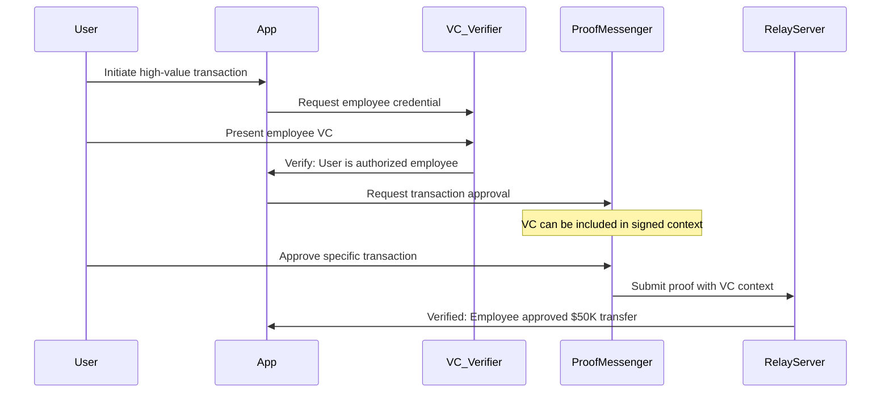
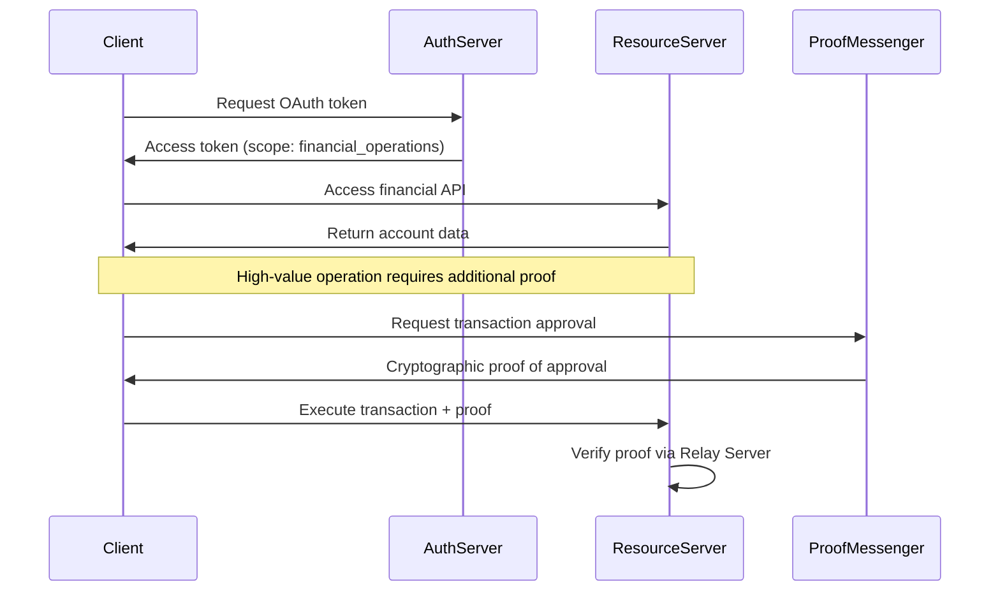

# Proof-Messenger Standards Position

## Table of Contents
1. [Our Philosophy on Open Standards](#our-philosophy-on-open-standards)
2. [Our Core Focus: Verifiable Transactional Intent](#our-core-focus-verifiable-transactional-intent)
3. [Relationship to Key Standards & Technologies](#relationship-to-key-standards--technologies)
4. [Technical Architecture & Standards Alignment](#technical-architecture--standards-alignment)
5. [Our Standardization Roadmap](#our-standardization-roadmap)
6. [Community Engagement Strategy](#community-engagement-strategy)
7. [Future Standards Contributions](#future-standards-contributions)

## 1. Our Philosophy on Open Standards

Proof-Messenger is built on a foundation of **open and proven technologies**, from the underlying cryptography to the WebAssembly runtime environment. We believe that open standards are the bedrock of a secure, interoperable, and innovative internet.

The purpose of this document is to clarify our position relative to existing and emerging digital identity standards and to outline our philosophy for future engagement with standards bodies like the **W3C**, **IETF**, **FIDO Alliance**, and **OpenID Foundation**.

### Our Standards Philosophy

**🎯 Standards Should Emerge from Proven Implementations**  
We believe that successful standards emerge from proven, real-world implementations that solve demonstrated market needs. Our current focus is on validating the core protocol and achieving product-market fit to solve a specific, urgent enterprise need.

**🤝 Collaboration Over Competition**  
We view existing standards as complementary technologies that can work together to create a more secure and user-friendly digital ecosystem. Our goal is to be a good ecosystem citizen and contribute meaningfully to the broader identity community.

**🔄 Iterative Refinement**  
Standards should evolve through iterative refinement based on real-world deployment experience, security research, and community feedback. We are committed to this process of continuous improvement.

**🌐 Interoperability First**  
Any future standardization efforts should prioritize interoperability and avoid vendor lock-in. We are designing Proof-Messenger with this principle in mind from the ground up.

**🏢 Self-Hosted Governance**  
We believe enterprises must maintain control over their authorization infrastructure. Our "self-hosted first" approach ensures that organizations own their trust model and control their data, which is essential for both security and standards compliance.

## 2. Our Core Focus: Verifiable Transactional Intent

To understand our relationship with other standards, it is critical to understand our **specific focus**. Proof-Messenger is designed to solve the problem of **verifiable transactional intent**.

### The Authorization Gap in Current Standards

| Standard Category | Primary Question | Example Use Cases | Limitations |
|-------------------|------------------|-------------------|-------------|
| **Identity Standards** (VCs/DIDs) | "Who are you?" or "What are you qualified for?" | Professional credentials, age verification, membership status | Static attributes, not transaction-specific |
| **Authentication Standards** (WebAuthn/FIDO) | "Can you prove you control this key/device?" | Login, device binding, session establishment | Binary yes/no, lacks transaction context |
| **Authorization Standards** (OAuth 2.0/OIDC) | "What resources can you access?" | API access, resource permissions, scope-based access | Coarse-grained, session-level permissions |
| **🎯 Proof-Messenger** | **"Did you provide non-repudiable approval for this specific transaction?"** | **Wire transfers, contract signing, privileged operations** | **Fine-grained, context-aware, non-repudiable** |

### Our Unique Value Proposition

**🔐 Transactional Context Binding**  
Unlike authentication (which proves identity) or traditional authorization (which grants access), Proof-Messenger creates cryptographic proof that a specific user approved a specific transaction with full knowledge of its details.

**⚡ Dynamic, In-Session Authorization**  
While VCs prove static attributes and WebAuthn proves key control, Proof-Messenger focuses on authorizing dynamic, in-session actions with rich contextual information.

**📋 Non-Repudiation by Design**  
The cryptographic signature is bound to the exact transaction details, making it impossible for users to later claim they didn't approve the specific action.

**🏢 Enterprise-Grade Auditability**  
Every proof includes sufficient context for compliance auditing and legal verification, addressing enterprise requirements that existing standards don't fully address.

## 3. Relationship to Key Standards & Technologies

### 3.1 W3C Verifiable Credentials (VCs) & Decentralized Identifiers (DIDs)

**🤝 Complementary, Not Competitive**

VCs and DIDs are powerful emerging standards for portable, user-centric identity. They allow users to hold and present cryptographically verifiable "claims" about themselves (e.g., "I have a driver's license," "I am an employee of Acme Corp.").

**Proof-Messenger is complementary to, not competitive with, VCs and DIDs.**

#### Different Jobs to Be Done

| Aspect | Verifiable Credentials | Proof-Messenger |
|--------|----------------------|-----------------|
| **Purpose** | Prove user attributes/qualifications | Prove transaction approval |
| **Timing** | Static, long-lived claims | Dynamic, moment-in-time actions |
| **Content** | Identity attributes, credentials | Transaction context, business logic |
| **Verification** | Attribute validity | Intent and approval |
| **Lifecycle** | Issued, held, presented | Generated, signed, verified |

#### Potential for Powerful Synergy

The two systems can work together in sophisticated workflows:



**Example Integration Scenario:**
1. **Identity Verification**: User presents a VC proving they are an authorized financial officer
2. **Transaction Authorization**: User then uses Proof-Messenger to approve a specific $50,000 wire transfer
3. **Audit Trail**: The Proof-Messenger context includes both the transaction details AND the presented VC for complete auditability

#### Technical Integration Points

```json
{
  "proof_messenger_context": {
    "transaction": {
      "type": "wire_transfer",
      "amount_usd_cents": 5000000,
      "destination": "ACME-CORP-ACCOUNT"
    },
    "authorization_context": {
      "presented_credentials": [
        {
          "type": "VerifiableCredential",
          "credentialSubject": {
            "role": "financial_officer",
            "authority_limit_usd": 100000
          },
          "proof": {
            "type": "Ed25519Signature2020",
            "verificationMethod": "did:example:123#key-1"
          }
        }
      ]
    },
    "timestamp": "2024-01-15T10:30:00Z"
  }
}
```

### 3.2 FIDO Alliance / WebAuthn

**🏗️ WebAuthn as Our Foundation Layer**

As stated in our architecture documentation, we consider **WebAuthn and passkeys to be the foundational Layer 1** for authentication. Proof-Messenger is designed as a **Layer 2 for authorization**.

#### Layered Security Architecture

```
┌─────────────────────────────────────────────────────────────┐
│ Layer 3: Business Logic & Compliance                       │
│ • Audit logging • Policy enforcement • Regulatory compliance│
├─────────────────────────────────────────────────────────────┤
│ Layer 2: Transaction Authorization (Proof-Messenger)       │
│ • Context-aware approval • Non-repudiation • Intent proof  │
├─────────────────────────────────────────────────────────────┤
│ Layer 1: User Authentication (WebAuthn/FIDO)              │
│ • Identity verification • Device binding • Session establishment│
├─────────────────────────────────────────────────────────────┤
│ Layer 0: Cryptographic Primitives                         │
│ • Hardware security modules • Secure enclaves • Key management│
└─────────────────────────────────────────────────────────────┘
```

#### Integration with WebAuthn

**Authentication First**: We assume and recommend that users are first authenticated into a session using a strong, standards-based mechanism like a passkey.

**Authorization Next**: Proof-Messenger is then invoked within that secure session to authorize specific, high-risk actions that require more granular and context-aware proof than the initial login provides.

```javascript
// Example: WebAuthn + Proof-Messenger Integration
class SecureTransactionFlow {
    async executeHighValueTransaction(transactionDetails) {
        // Layer 1: Ensure user is authenticated via WebAuthn
        if (!await this.verifyWebAuthnSession()) {
            throw new Error("User must be authenticated via WebAuthn first");
        }
        
        // Layer 2: Get specific authorization for this transaction
        const proof = await this.proofMessenger.requestApproval({
            context: transactionDetails,
            requireUserPresence: true,
            includeSessionContext: true
        });
        
        // Layer 3: Execute transaction with cryptographic proof
        return await this.executeTransaction(transactionDetails, proof);
    }
}
```

#### Alignment with FIDO Alliance Goals

| FIDO Alliance Goal | How Proof-Messenger Supports |
|-------------------|------------------------------|
| **Passwordless Authentication** | Builds on WebAuthn foundation, never requires passwords |
| **Phishing Resistance** | Context binding prevents transaction manipulation attacks |
| **User Privacy** | No PII required beyond transaction context |
| **Interoperability** | Works with any WebAuthn-compliant authenticator |
| **Scalability** | Designed for enterprise-scale deployment |

### 3.3 OAuth 2.0 / OpenID Connect (OIDC)

**🔗 Complementary Authorization Patterns**

OAuth 2.0 and OIDC excel at **resource-based authorization** (what APIs can you access?) while Proof-Messenger focuses on **transaction-based authorization** (did you approve this specific action?).

#### Different Authorization Models

| Aspect | OAuth 2.0/OIDC | Proof-Messenger |
|--------|----------------|-----------------|
| **Granularity** | Resource/scope level | Transaction level |
| **Duration** | Session/token lifetime | Single-use, moment-in-time |
| **Context** | Resource access permissions | Rich transaction details |
| **Revocation** | Token revocation | Cannot be revoked (non-repudiation) |
| **Audit** | Access logs | Cryptographic proof |

#### Potential Integration Scenarios



### 3.4 IETF & W3C Standards Bodies

**🏛️ Deep Respect for Standards Bodies**

We hold the work of the **Internet Engineering Task Force (IETF)** and the **World Wide Web Consortium (W3C)** in the highest regard. These bodies are the proper venues for formalizing new internet-scale protocols.

#### Current Monitoring & Engagement

**IETF Working Groups We're Monitoring:**
- **OAuth Working Group**: Evolution of authorization protocols
- **COSE Working Group**: CBOR Object Signing and Encryption
- **ACME Working Group**: Automated certificate management
- **TLS Working Group**: Transport layer security improvements

**W3C Working Groups We're Monitoring:**
- **Web Authentication Working Group**: WebAuthn evolution
- **Verifiable Credentials Working Group**: VC/DID standards
- **Web Application Security Working Group**: Browser security
- **Privacy Interest Group**: Privacy-preserving technologies

#### Standards Alignment Strategy

```
Current Protocol Status: Proprietary (for rapid iteration)
                ↓
Open Source Release: Reference implementation
                ↓
Community Engagement: Developer feedback & security review
                ↓
Standards Proposal: Formal submission to appropriate WG
                ↓
Standardization: Collaborative refinement process
```

## 4. Technical Architecture & Standards Alignment

### 4.1 Cryptographic Standards Compliance

**🔐 Built on Proven Cryptographic Standards**

| Component | Standard | Implementation |
|-----------|----------|----------------|
| **Digital Signatures** | ECDSA (FIPS 186-4) | P-256 curve, SHA-256 |
| **Hash Functions** | SHA-2 (FIPS 180-4) | SHA-256 for context hashing |
| **Key Derivation** | HKDF (RFC 5869) | For key material derivation |
| **Random Generation** | FIPS 140-2 Level 2 | Hardware RNG when available |
| **Encoding** | CBOR (RFC 8949) | Compact binary encoding |

### 4.2 Web Standards Compliance

**🌐 Web Platform Integration**

| Standard | Usage | Compliance Level |
|----------|-------|------------------|
| **WebAssembly** | Core runtime | Full WASM 1.0 compliance |
| **WebAuthn** | Authentication layer | Level 2 specification |
| **Web Crypto API** | Cryptographic operations | Subset usage for hashing |
| **Content Security Policy** | Security headers | Strict CSP requirements |
| **CORS** | Cross-origin requests | Proper CORS implementation |

### 4.3 Enterprise Standards Alignment

**🏢 Enterprise Integration Standards**

| Standard | Purpose | Implementation Status |
|----------|---------|----------------------|
| **SAML 2.0** | Enterprise SSO | Integration planned |
| **SCIM 2.0** | User provisioning | Future consideration |
| **LDAP/AD** | Directory integration | Via existing auth systems |
| **PKCS#11** | Hardware token support | Through WebAuthn |
| **X.509** | Certificate management | For server certificates |

## 5. Our Standardization Roadmap

Our approach to standardization is **pragmatic and phased**, ensuring that any future standards work is based on proven technology and real-world deployment experience.

### Phase 1: Market Validation (Current - 2024)

**🎯 Primary Focus**: Working with enterprise design partners to solve real-world problems

**Key Activities**:
- Refining the protocol based on enterprise feedback
- Hardening the implementation for production use
- Gathering performance and usability data
- Building security audit trail and compliance evidence

**Standards Engagement**:
- Monitoring relevant working groups
- Participating in community discussions
- Building relationships with standards experts
- Contributing to security research

**Success Metrics**:
- ✅ 10+ enterprise deployments
- ✅ Security audit completion
- ✅ Performance benchmarks established
- ✅ Compliance framework validation

### Phase 2: Open Source & Community Building (2025)

**🔓 Primary Focus**: Open-sourcing reference implementation and building developer ecosystem

**Key Activities**:
- Open-source the core protocol implementation
- Publish comprehensive developer documentation
- Create SDK libraries for multiple languages
- Establish community governance model

**Standards Engagement**:
- Present at relevant conferences (IETF meetings, W3C workshops)
- Publish technical papers and RFCs
- Engage with security research community
- Collaborate with other standards implementers

**Success Metrics**:
- ✅ Open source community adoption
- ✅ Independent security reviews
- ✅ Multi-language SDK ecosystem
- ✅ Academic research citations

### Phase 3: Formal Standardization (2026+)

**📜 Primary Focus**: Contributing to formal standards development

**Key Activities**:
- Submit Internet-Draft to IETF
- Participate in working group formation
- Collaborate on specification development
- Support interoperability testing

**Standards Bodies Engagement**:

#### IETF Engagement Strategy
```
Internet-Draft Submission
        ↓
Working Group Adoption
        ↓
Specification Development
        ↓
Working Group Last Call
        ↓
IESG Review
        ↓
RFC Publication
```

#### W3C Engagement Strategy
```
Community Group Formation
        ↓
Working Group Charter
        ↓
Specification Development
        ↓
Candidate Recommendation
        ↓
Proposed Recommendation
        ↓
W3C Recommendation
```

**Success Metrics**:
- ✅ IETF Internet-Draft acceptance
- ✅ Working group formation
- ✅ Multiple interoperable implementations
- ✅ Industry adoption of standard

## 6. Community Engagement Strategy

### 6.1 Current Community Participation

**🤝 Active Engagement Areas**

| Community | Participation Level | Contributions |
|-----------|-------------------|---------------|
| **FIDO Alliance** | Observer | WebAuthn integration feedback |
| **W3C WebAuthn WG** | Mailing list | Use case contributions |
| **IETF OAuth WG** | Meeting attendance | Authorization pattern research |
| **OpenID Foundation** | Community member | Enterprise requirements input |
| **Rust Security WG** | Contributor | Memory safety best practices |

### 6.2 Knowledge Sharing Initiatives

**📚 Educational Content**
- Technical blog posts on authorization patterns
- Conference presentations on transaction security
- Whitepapers on enterprise identity challenges
- Open source security tools and libraries

**🔬 Research Contributions**
- Academic collaborations on cryptographic protocols
- Security analysis of existing standards
- Performance benchmarking studies
- Privacy-preserving authorization research

### 6.3 Standards Development Participation

**📋 Working Group Contributions**

```
Current Contributions:
├── Use case documentation
├── Implementation experience reports
├── Security analysis feedback
├── Interoperability testing
└── Best practices documentation

Future Contributions:
├── Protocol specification drafts
├── Reference implementation
├── Test suite development
├── Security considerations
└── Deployment guidance
```

## 7. Future Standards Contributions

### 7.1 Potential New Standards Areas

**🚀 Areas Where We Could Lead Standards Development**

#### Transaction Authorization Protocol (TAP)
- **Scope**: Standardized protocol for transaction-specific authorization
- **Target**: IETF OAuth Working Group or new WG
- **Timeline**: 2026-2027
- **Value**: Fills gap between authentication and resource authorization

#### Context-Aware Authorization Framework (CAAF)
- **Scope**: Framework for rich context in authorization decisions
- **Target**: W3C Web Application Security WG
- **Timeline**: 2025-2026
- **Value**: Enables privacy-preserving, context-rich authorization

#### Non-Repudiation Assertion Format (NRAF)
- **Scope**: Standardized format for non-repudiation proofs
- **Target**: IETF COSE Working Group
- **Timeline**: 2025-2026
- **Value**: Interoperable non-repudiation across systems

### 7.2 Standards Enhancement Contributions

**🔧 Enhancements to Existing Standards**

#### WebAuthn Extensions
```javascript
// Proposed extension for transaction context
const credential = await navigator.credentials.create({
    publicKey: {
        // ... standard WebAuthn options
        extensions: {
            "txnContext": {
                "context": transactionDetails,
                "binding": "required"
            }
        }
    }
});
```

#### OAuth 2.0 Transaction Tokens
```http
POST /token HTTP/1.1
Content-Type: application/x-www-form-urlencoded

grant_type=transaction_authorization&
context=eyJ0eXAiOiJKV1QiLCJhbGciOiJFUzI1NiJ9...&
proof=eyJ0eXAiOiJKV1QiLCJhbGciOiJFUzI1NiJ9...
```

#### Verifiable Credentials Context Binding
```json
{
  "@context": [
    "https://www.w3.org/2018/credentials/v1",
    "https://proof-messenger.org/contexts/transaction/v1"
  ],
  "type": ["VerifiableCredential", "TransactionAuthorizationCredential"],
  "credentialSubject": {
    "transactionApproval": {
      "context": "...",
      "timestamp": "2024-01-15T10:30:00Z",
      "proof": "..."
    }
  }
}
```

### 7.3 Interoperability Standards

**🔗 Cross-Standard Integration Patterns**

#### Universal Authorization Interface (UAI)
```typescript
interface UniversalAuthorizationProvider {
    // Support multiple authorization patterns
    authenticate(method: 'webauthn' | 'oauth' | 'vc'): Promise<AuthResult>;
    authorize(context: TransactionContext): Promise<AuthorizationProof>;
    verify(proof: AuthorizationProof): Promise<VerificationResult>;
}
```

#### Authorization Interoperability Protocol (AIP)
```
┌─────────────────┐    ┌─────────────────┐    ┌─────────────────┐
│   OAuth 2.0     │    │ Proof-Messenger │    │ Verifiable      │
│   Provider      │◄──►│    Protocol     │◄──►│ Credentials     │
└─────────────────┘    └─────────────────┘    └─────────────────┘
         │                       │                       │
         └───────────────────────┼───────────────────────┘
                                 │
                    ┌─────────────────┐
                    │ Interoperability│
                    │    Gateway      │
                    └─────────────────┘
```

## Conclusion

Proof-Messenger represents a focused solution to a specific gap in the current standards landscape: **verifiable transactional intent**. We are not seeking to replace existing standards but to complement them in creating a more secure and user-friendly digital ecosystem.

### Our Commitments

**🤝 To the Standards Community**:
- Transparent development and open collaboration
- Contribution of real-world implementation experience
- Support for interoperability and vendor neutrality
- Participation in formal standards development processes

**🏢 To Enterprise Users**:
- Standards-based implementation wherever possible
- Clear migration path to future standards
- Interoperability with existing identity infrastructure
- Long-term support and backward compatibility

**🔒 To Security**:
- Rigorous security analysis and peer review
- Adoption of proven cryptographic standards
- Transparent vulnerability disclosure process
- Continuous security improvement based on research

### The Path Forward

We believe that successful standards emerge from proven implementations that solve real problems. Our roadmap reflects this philosophy:

1. **Prove the concept** with real enterprise deployments
2. **Open the implementation** for community review and contribution
3. **Engage with standards bodies** to formalize the protocol
4. **Support interoperability** across the broader identity ecosystem

By following this path, we aim to contribute meaningfully to the evolution of digital identity and authorization standards while solving urgent enterprise security needs today.

---

**For questions about our standards position or to discuss collaboration opportunities, please contact:**

**Standards Team**: standards@proof-messenger.com  
**Technical Lead**: [Name] <tech-lead@proof-messenger.com>  
**Community Manager**: [Name] <community@proof-messenger.com>

**Document Version**: 1.0  
**Last Updated**: December 2024  
**Next Review**: June 2025  
**Classification**: Public