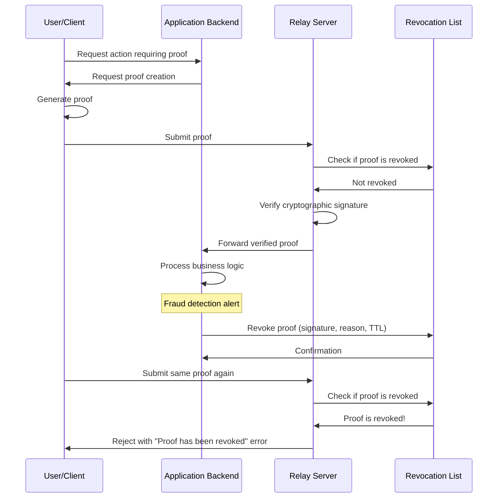

# Proof Revocation Flow Diagram



## Revocation Database Schema

```sql
CREATE TABLE revoked_proofs (
    proof_signature TEXT PRIMARY KEY NOT NULL,
    revoked_at DATETIME NOT NULL DEFAULT CURRENT_TIMESTAMP,
    reason TEXT,
    revoked_by TEXT,
    expires_at DATETIME -- Optional expiration time for TTL
);

-- Index for efficient expiration-based cleanup
CREATE INDEX idx_revoked_proofs_expires_at 
ON revoked_proofs(expires_at);
```

## Revocation API Request/Response Examples

### Revoke a Proof

**Request:**
```json
POST /revocation/revoke
{
  "proof_signature": "a1b2c3d4e5f6...",
  "reason": "Fraud detection alert",
  "ttl_hours": 24
}
```

**Response:**
```json
{
  "status": "success",
  "message": "Proof revoked successfully",
  "proof_signature": "a1b2c3d4e5f6...",
  "ttl_hours": 24
}
```

### Check if a Proof is Revoked

**Request:**
```
GET /revocation/check/a1b2c3d4e5f6...
```

**Response:**
```json
{
  "is_revoked": true,
  "checked_at": "2023-06-15T14:30:45Z",
  "proof_signature": "a1b2c3d4e5f6..."
}
```

### List Active Revocations

**Request:**
```
GET /revocation/list
```

**Response:**
```json
{
  "status": "success",
  "count": 2,
  "revocations": [
    {
      "proof_signature": "a1b2c3d4e5f6...",
      "revoked_at": "2023-06-15T14:30:45Z",
      "reason": "Fraud detection alert",
      "revoked_by": "system",
      "expires_at": "2023-06-16T14:30:45Z"
    },
    {
      "proof_signature": "g7h8i9j0k1l2...",
      "revoked_at": "2023-06-15T13:20:10Z",
      "reason": "User requested cancellation",
      "revoked_by": "user_123",
      "expires_at": "2023-06-16T13:20:10Z"
    }
  ]
}
```